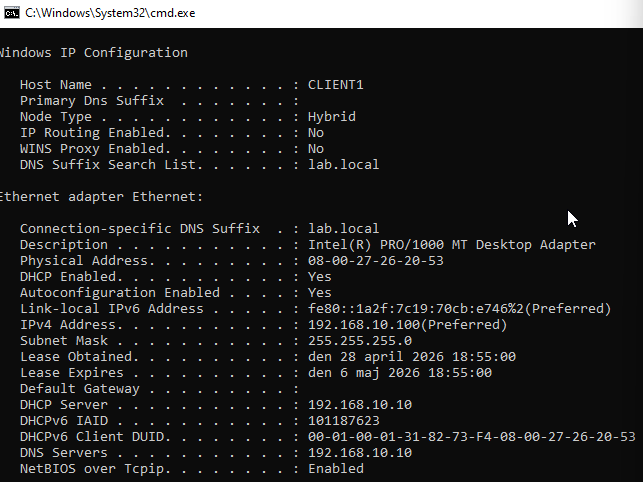
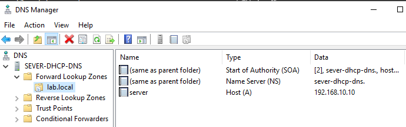
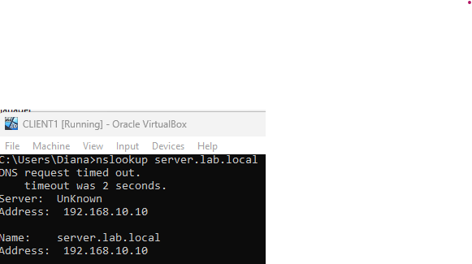
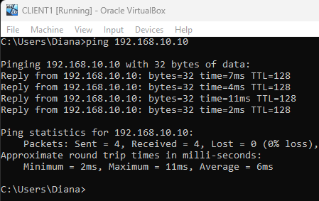
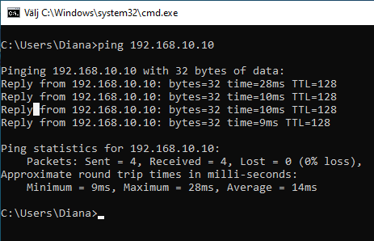
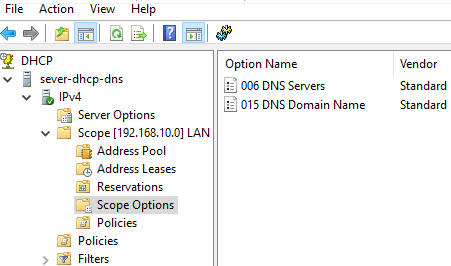

# Windows Server DHCP + DNS Lab with Client Validation

## Project Overview

In this project, I installed and configured DHCP and DNS services on Windows Server 2019 within an isolated Oracle VirtualBox lab environment. A Windows 10 client was connected to the same internal network to validate automatic IP address assignment, DNS server delivery, internal name resolution, and basic network connectivity.

The goal of this lab was to practice core network administration tasks commonly used in IT support, network technician, NOC technician, and junior system administrator roles.

---

## Lab Objective

The objective of this lab was to demonstrate how DHCP can be configured to automatically assign IP addresses to client machines, and how DNS can be configured to resolve internal hostnames to IP addresses.

This lab also validates that a Windows 10 client can receive network configuration from a Windows Server 2019 machine and successfully communicate within an isolated internal network.

---

## Technologies Used

- **Oracle VirtualBox** – used to create an isolated internal lab network
- **Windows Server 2019** – configured as the DHCP and DNS server
- **Windows 10** – used as the client machine for validation
- **DHCP** – used to automatically assign IP addresses to clients
- **DNS** – used to resolve internal hostnames to IP addresses
- **Command Prompt** – used for client-side testing and troubleshooting
- **ipconfig** – used to verify DHCP and DNS configuration
- **ping** – used to test network connectivity
- **nslookup** – used to validate DNS name resolution

---

## Network Design

The lab was built using an isolated internal network in Oracle VirtualBox. Both the Windows Server 2019 machine and the Windows 10 client were connected to the same internal network to allow DHCP and DNS communication without requiring internet access.

### VirtualBox Network

| Setting | Value |
|---|---|
| Network Type | Internal Network |
| Network Name | LABNET |

### Devices

| Device | Role | IP Address | Notes |
|---|---|---|---|
| SRV-DHCP-DNS | DHCP and DNS Server | 192.168.10.10 | Static IP address |
| CLIENT1 | Windows 10 Client | DHCP Assigned | Receives IP configuration automatically |

### IP Addressing Plan

| Network | Subnet Mask | DHCP Scope |
|---|---|---|
| 192.168.10.0/24 | 255.255.255.0 | 192.168.10.100 - 192.168.10.150 |

### DNS Test Record

| DNS Name | Record Type | IP Address |
|---|---|---|
| server.lab.local | A | 192.168.10.10 |

---

## Implementation Steps

The lab was implemented in a structured way to simulate a basic internal network environment using Windows Server and a Windows client.

1. Created two virtual machines in Oracle VirtualBox.
2. Connected both virtual machines to the same internal network named `LABNET`.
3. Installed Windows Server 2019 on the server VM.
4. Configured a static IP address on the server: `192.168.10.10`.
5. Installed the DHCP Server and DNS Server roles.
6. Created and activated a DHCP scope for the internal network.
7. Configured DHCP scope options to provide the DNS server address to clients.
8. Installed Windows 10 on the client VM.
9. Verified that the client received IP configuration automatically.
10. Validated connectivity and DNS name resolution using `ipconfig`, `ping`, and `nslookup`.

---

## DHCP Configuration

The DHCP Server role was configured on Windows Server 2019 to automatically provide IP addresses to client machines connected to the internal lab network.

A DHCP scope named `LAN Scope` was created with the following address range:

| Setting | Value |
|---|---|
| DHCP Scope | LAN Scope |
| IP Range | 192.168.10.100 - 192.168.10.150 |
| Subnet Mask | 255.255.255.0 |
| DHCP Server | 192.168.10.10 |
| DNS Server Option | 192.168.10.10 |

The DHCP scope was activated and configured to provide the DNS server address through scope option `006 DNS Servers`.

After connecting `CLIENT1` to the internal network, the client successfully received the IP address `192.168.10.100` from the DHCP server.

---

## DNS Configuration

The DNS Server role was configured on Windows Server 2019 to provide internal name resolution for the lab network.

A forward lookup zone named `lab.local` was created. Inside this zone, an A record named `server` was configured to resolve to the server IP address `192.168.10.10`.

| DNS Zone | Record Type | Hostname | IP Address |
|---|---|---|---|
| lab.local | A | server.lab.local | 192.168.10.10 |

DNS resolution was validated from `CLIENT1` using `nslookup` and `ping`:

```cmd
nslookup server.lab.local
ping server.lab.local
```

The client successfully resolved `server.lab.local` to `192.168.10.10`.

---

## Client Validation

The Windows 10 client `CLIENT1` was used to validate the DHCP and DNS configuration.

First, the command `ipconfig /all` was used to verify that the client received its network configuration automatically from the DHCP server.

| Validation Item | Result |
|---|---|
| Client IP Address | 192.168.10.100 |
| Subnet Mask | 255.255.255.0 |
| DHCP Server | 192.168.10.10 |
| DNS Server | 192.168.10.10 |

Basic connectivity to the server was tested using:

```cmd
ping 192.168.10.10
```

DNS name resolution was validated using:

```cmd
nslookup server.lab.local
ping server.lab.local
```

The client successfully received an IP address from the DHCP scope, used the Windows Server machine as its DNS server, and resolved the internal hostname `server.lab.local` to `192.168.10.10`.

---

## Evidence

### DHCP Client Configuration

The Windows 10 client successfully received an IP address from the DHCP scope. The DHCP server and DNS server were both assigned as `192.168.10.10`.



### DNS Server Configuration

A forward lookup zone named `lab.local` was created, including an A record for `server.lab.local` pointing to `192.168.10.10`.



### DNS Resolution Test

DNS resolution was validated from `CLIENT1` using `nslookup`.



<details>
<summary>Additional Evidence</summary>

### Ping to Server IP

This test confirms that `CLIENT1` can communicate with the server using its IP address.



### Ping Using DNS Name

This test confirms that `CLIENT1` can resolve and reach the server using the internal DNS name `server.lab.local`.



### DHCP Scope Options

This screenshot shows the DHCP scope option used to provide the DNS server address `192.168.10.10` to clients.



</details>

---

## Troubleshooting

During the lab, `CLIENT1` successfully received an IP address from the DHCP server. However, the initial ping test to the server failed because Windows Server Firewall was blocking ICMP traffic.

To resolve this issue, the inbound firewall rule for **ICMPv4 Echo Request** was enabled. After allowing ICMP traffic, `CLIENT1` was able to successfully ping the server at `192.168.10.10`.

Another issue occurred during DNS validation. The DNS query initially returned a non-existent domain response, so the DNS forward lookup zone and A record were reviewed. The issue was resolved by confirming that the `lab.local` zone contained an A record named `server` pointing to `192.168.10.10`.

After these corrections, `CLIENT1` was able to resolve and ping `server.lab.local` successfully.

---

## Skills Demonstrated

This project demonstrates practical skills in Windows Server administration, DHCP and DNS configuration, internal network design, client-server connectivity, and basic network troubleshooting.

Key skills demonstrated in this lab include:

- Configuring Windows Server 2019 as a DHCP and DNS server
- Creating and activating a DHCP scope
- Assigning DNS server settings through DHCP scope options
- Creating a DNS forward lookup zone
- Configuring an A record for internal name resolution
- Connecting a Windows 10 client to an isolated VirtualBox network
- Validating DHCP configuration using `ipconfig /all`
- Testing connectivity using `ping`
- Validating DNS resolution using `nslookup`
- Troubleshooting firewall and DNS resolution issues

---

## Conclusion

This lab provided hands-on practice with essential network services such as DHCP and DNS in a controlled VirtualBox environment. By configuring Windows Server 2019 and validating the setup from a Windows 10 client, I was able to demonstrate automatic IP address assignment, internal DNS name resolution, client-server connectivity, and basic troubleshooting skills.

This project strengthened my understanding of core network administration tasks relevant to IT support, network technician, NOC technician, and junior system administrator roles.
